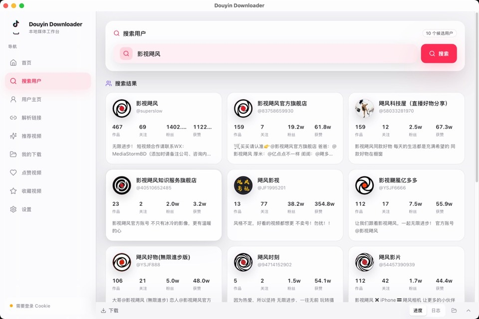
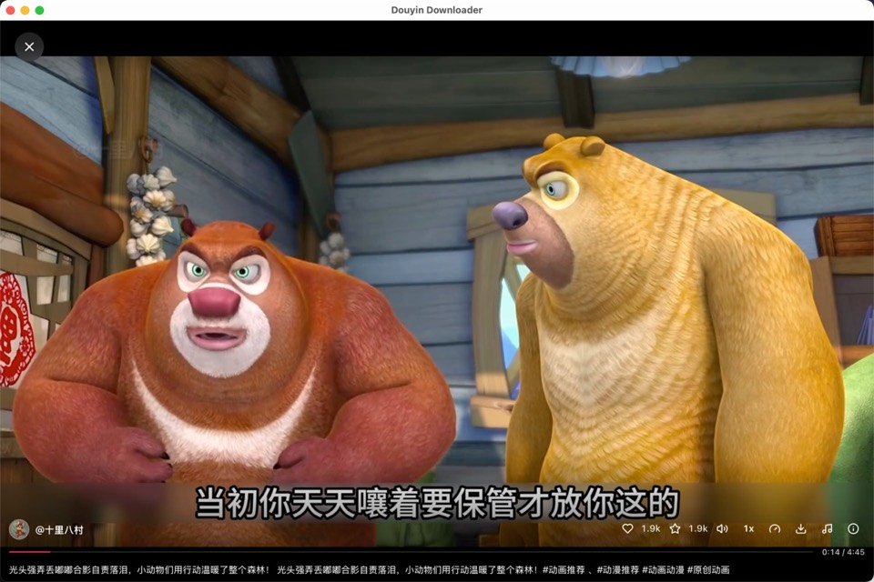
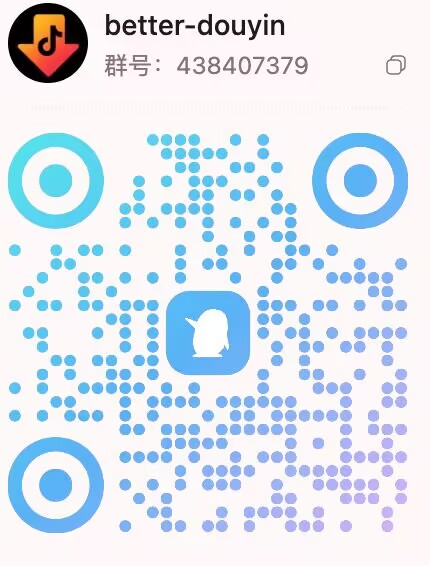

<div align="center">


# better-douyin

抖音内容下载、预览与本地归档工具。用 Python 构建，适合源码阅读、二次开发和桌面/浏览器两种运行方式。

<p>
  <a href="README.md">简体中文</a> | <a href="README_EN.md">English</a>
</p>

<p>
  <a href="https://www.python.org/"></a>
  <a href="https://github.com/anYuJia/better-douyin/releases/latest"></a>
  <a href="https://github.com/anYuJia/better-douyin/releases"></a>
  
  <a href="LICENSE"></a>
</p>

[下载发行版](../../releases/latest) · [界面预览](#界面预览) · [快速开始](#快速开始) · [加入交流群](#加入交流群)

</div>

---

## 为什么选择它

- 支持用户搜索、主页作品、收藏、点赞、分享链接解析与批量下载
- 推荐流预览、沉浸式播放、一键下载，适合边看边归档
- 私信图片、本地媒体与聊天历史体验持续优化
- “我的下载”提供文件/作品两种视图，支持搜索、播放、定位和删除
- 自动识别已下载作品，减少重复保存
- Cookie、下载历史、配置与文件均保存在本机

> 日常桌面使用更推荐 Rust / Tauri 版：[better-douyin-R](https://github.com/anYuJia/better-douyin-R)。

## 界面预览

<p align="center">
  <a href="img/index.jpg"></a>
  <br>
  <strong>主界面</strong>
</p>

<p align="center">
  <a href="img/get_user.jpg"></a>
  <br>
  <strong>搜索用户</strong>
</p>

<p align="center">
  <a href="img/user_detail.jpg"></a>
  <br>
  <strong>用户主页 / 批量下载</strong>
</p>

<p align="center">
  <a href="img/recommend.jpg"></a>
  <br>
  <strong>推荐视频流</strong>
</p>

<p align="center">
  <a href="img/playvideo.jpg"></a>
  <br>
  <strong>沉浸式播放器</strong>
</p>

## 快速开始

从 [Releases](../../releases/latest) 下载对应平台文件，解压或安装后运行。

| 平台 | 推荐下载 |
|:---|:---|
| Windows | `.exe` 安装版或 `.zip` 便携版 |
| macOS | `.dmg` 或 `.app` |
| Linux | `.tar.gz` |

macOS 首次运行如提示无法验证开发者：

```bash
sudo xattr -rd com.apple.quarantine /path/to/better-douyin.app
```

源码运行：

```bash
git clone https://github.com/anYuJia/better-douyin.git
cd better-douyin

python -m venv .venv
source .venv/bin/activate  # Windows: .venv\Scripts\activate

pip install -r requirements.txt
cd frontend && npm install && npm run build && cd ..

python main.py
```

浏览器 / 无界面模式：

```bash
python -m src.web.web_app
```

## 首次使用

1. 在设置中配置 Cookie 与下载目录。
2. 通过内置登录、浏览器读取或手动粘贴完成登录态配置。
3. 使用搜索用户、解析链接、推荐流、收藏或点赞列表获取内容。
4. 下载单个作品，或进入列表执行批量下载。
5. 在底部任务面板查看进度，在“我的下载”管理本地文件。

## 加入交流群

欢迎加入 QQ 群交流使用体验、问题反馈与功能建议。

<p align="center">
  
  <br>
  <strong>QQ群：438407379</strong>
</p>

## Cookie 与隐私

- Cookie 仅用于本机请求抖音相关接口，不会上传到本项目服务器
- 下载历史、配置和缓存数据均保存在本机
- 推荐、收藏、点赞和部分批量能力依赖有效 Cookie
- 如果接口异常，优先检查 Cookie、账号验证状态和网络环境

## 常见问题

### Cookie 失效或无法获取作品？

重新登录或重新读取 Cookie，并确认账号在浏览器中可以正常访问目标内容。

### 下载慢或失败？

通常与网络、资源可用性、平台响应或 Cookie 状态有关。可减少并发、刷新 Cookie，或稍后重试。

### 为什么已下载作品会被跳过？

应用会记录下载历史并检查本地文件，避免重复下载。若移动过文件，请在“我的下载”中确认当前目录。

### 可以在 Linux 服务器上运行吗？

可以，建议使用浏览器 / 无界面模式。远程访问时请自行处理访问控制、反向代理和 Cookie 暴露风险。

## 开发

| 模块 | 技术 |
|:---|:---|
| 桌面窗口 | pywebview |
| 本地服务 | Flask, Flask-SocketIO |
| 下载能力 | asyncio, aiohttp, requests |
| 前端界面 | React, Vite, TypeScript, Tailwind CSS |
| 打包分发 | PyInstaller |

## 免责声明

本项目仅供个人学习、研究和内容备份使用。请遵守相关法律法规、平台规则和内容版权要求，不得用于商业采集或大规模爬取。因不当使用造成的后果由使用者自行承担。

## Star History

<p align="center">
  <a href="https://star-history.com/#anYuJia/better-douyin&Date">
    
  </a>
</p>

---

<p align="center">如果这个项目对你有帮助，欢迎 Star 支持。</p>
